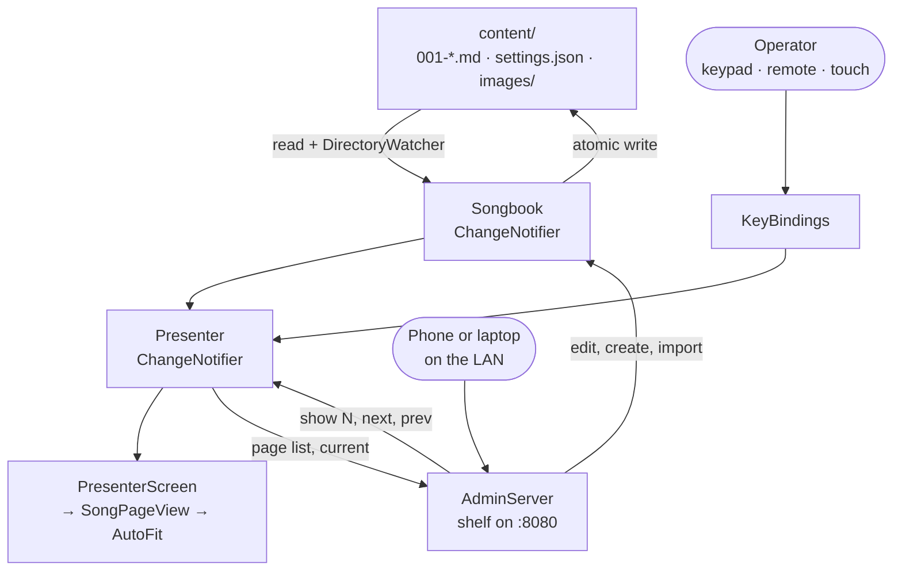

# Architecture

How Pesmarica is put together, and why. `README.md` covers what it does;
`CLAUDE.md` covers the traps when editing it.

## The shape of it

There is no database, no service layer and no state-management package. A
songbook is a folder of markdown files, and the whole app is two
`ChangeNotifier`s over that folder plus a widget tree and an HTTP server, wired
together by hand in `main.dart`.



Two rules fall out of that picture and most of the design follows from them:

1. **The folder is the only source of truth.** The web interface does not hold
   a copy of a page; it writes markdown and lets the file watcher tell the
   display. Editing a file over SSH and editing it in the browser take exactly
   the same path.
2. **A page carries its own presentation.** Magnification, alignment, title
   visibility and usage all live in that page's front matter, so a songbook can
   be copied to another screen and look identical.

## Layers

### `Songbook` — the folder

`lib/src/data/songbook.dart`. Owns the content directory: loads it, watches it,
and is the only thing that writes to it.

**Loading.** Every `*.md` is parsed into a `SongPage`. The page number comes
from the file name prefix (`012-nekaj.md` → 12) so the operator's keypad and the
file system agree without a separate index. Files with no numeric prefix still
get a slot, numbered after the highest number seen, so a stray note never hides
a page. A file that fails to parse is skipped with a log line rather than taking
the screen down.

**Watching.** A `DirectoryWatcher` feeds `_onFileEvent`, debounced 250 ms into a
full `reload()`. Reloading everything on any change is wasteful and completely
fine: a songbook is a few hundred small files, and the alternative is
incremental-update bugs on a machine nobody can debug.

**Writing.** Everything goes through `_write`, which writes `<path>.tmp` and
renames it into place. The box loses mains power, and `writeAsString` truncates
before it writes — an interrupted write would otherwise leave an empty page or
an empty `settings.json`. Rename is atomic on the same filesystem, so a reader
sees the old file or the new one and never a half-written one.

**Not looping.** Every write stamps its path into `_selfWrites`; `_onFileEvent`
ignores events for paths written in the last 2 s, and ignores `.tmp` entirely.
Without that, writing a zoom level would trigger a reload, which would notify
the presenter, which would rewrite the file.

### `Presenter` — what is on screen

`lib/src/data/presenter.dart`. Holds the current index, the half-typed page
number, the transient flash message and the help overlay. It owns no content —
it asks the songbook.

**Number entry** is PowerPoint's model with one change: a half-typed number
times out after 3 s. PowerPoint waits for Enter forever, which on a wall display
means a forgotten "12" sitting in the corner looking broken.

**Usage** is recorded through a 5 s dwell timer (`dwellBeforeCounting`). A page
only counts as shown once it has stayed up that long, so paging through twenty
pages to find something does not rewrite twenty files.

**Surviving a reload.** When the songbook reloads underneath it, the presenter
re-finds the page by *number*, not index — the file list may have shifted while
the operator was not looking.

### Input

`lib/src/input/key_bindings.dart` is a pure function from `KeyEvent` to a
presenter action, which is why it is unit-testable without a widget tree.

Digits and `+`/`−` are matched on `event.character`, not on the physical key.
A Slovenian layout, a USB numeric keypad and a €20 presenter remote all produce
different physical keys for the same character; matching the character is the
only thing that works across all three. Navigation keys have no character, so
those match on `LogicalKeyboardKey`.

`Enter` and `Backspace` are context-sensitive: Enter commits a pending number
and otherwise advances a page; Backspace deletes a digit and otherwise goes
back. `commitNumberEntry()` returns a bool so the binding layer can make that
decision without reaching into presenter state.

### Rendering

```
PresenterScreen          palette, chrome bar, overlays, key focus, tap zones
  └── SongPageView       resolves title visibility and images
        └── AutoFit      finds a font size that fits
              └── MarkdownBody
```

**Type size is derived, not configured.** `SongPageView` starts from
`viewportHeight / 15`, so the same songbook reads correctly on a 1080p TV and a
4K panel without a per-screen setting. The page's `scale` and the songbook's
`baseScale` multiply that.

**`AutoFit` converges over frames.** Markdown reflows as the font size changes,
so the fitting size cannot be computed in one step. It renders inside an
`OverflowBox` with unbounded height, measures the result after the frame, and
if it overflows, scales by `viewport / measured` with a 1.5 % undershoot —
reflow after a shrink usually frees a little more height than the linear
estimate, and overshooting looks worse than one more pass. Capped at 8 passes,
and the child is held at opacity 0 until it settles. It restarts when its
`signature` changes; anything new that affects layout must go into that
signature.

**Two colours.** `PagePalette` is background, foreground and one muted tone.
Signage lives or dies on contrast, and the polarity switch has to stay a genuine
switch rather than two slightly different themes. The bundled sans and serif
families are variable fonts, so `fontStyle()` sets `fontVariations` alongside
`fontWeight` — `FontWeight` alone selects a named instance that a single-file
variable font does not have, and bold silently does nothing.

**Titles.** A title can live in the front matter or as the first heading of the
body, and `showTitle` has to mean the same thing either way. So hiding it also
drops a leading heading that repeats the title, and showing it draws the front
matter title as a heading when the body has none of its own.

### Web

`lib/src/web/admin_server.dart` is a shelf router. The interface itself is
ordinary static files — `assets/web/index.html`, `app.css`, `app.js`,
`login.html`, `login.js`, `favicon.svg` — served by `static_assets.dart` out of
the Flutter asset bundle.

Assets rather than files on disk, because the signage host has no document root
worth pointing at: on the Pi the app is a flutter-pi bundle in `/opt`, and a
static file server aimed at it would couple the HTTP layer to the deploy
layout. `rootBundle` reads the same way in a desktop debug run, a widget test
and a release bundle. They are cached in memory on first read with an md5
`ETag`, so a reload costs a 304 and the browser keeps the bytes.

Which files can be served is an allowlist (`StaticAssets.allowed`), not path
sanitising. The set is small and known at build time, so a traversal bug cannot
exist rather than being defended against. `test/static_assets_test.dart` checks
that every file the pages reference is on that list and actually bundled — the
failure mode it guards is renaming an asset and finding out in the church hall.

There is no build step for the UI, on purpose: the box is often offline, and a
broken asset pipeline at 8 am on a Sunday is not a failure mode worth having.

| | |
| --- | --- |
| `GET /` | the admin page |
| `GET /login` | the password form |
| `GET /static/<name>` | css, js, favicon |
| `POST /api/login`, `/api/logout` | set or clear the cookie |
| `GET /api/state` | pages, settings, current page, font list |
| `GET PUT DELETE /api/pages/<n>` | raw markdown of one page |
| `POST /api/pages` | create |
| `POST /api/import?name=` | take a dropped `.md` file |
| `POST /api/show/<n>`, `/api/next`, `/api/prev` | drive the display |
| `PUT /api/settings` | merge a settings patch |
| `POST /api/images?name=` | upload into `images/` |
| `GET /media/<name>` | serve one |

The browser polls `/api/state` every 4 s and skips the poll while there are
unsaved edits. Polling is the right amount of machinery here — a websocket
would buy sub-second freshness for a page whose job is to list a few dozen
songs.

Writes never go straight to the display: they go to the folder, and the watcher
does the rest. `PUT /api/settings` restarts the server when the port or the
enabled flag changed, so an operator who mistypes a port is not locked out of
fixing it.

**Import** keeps the number in a dropped file name when it is free, and
otherwise files the page after the last one rather than refusing. Someone
dropping a folder of songs should not have to resolve collisions one at a time.

### The network

The appliance is an access point, never a client. `hostapd` owns the radio,
`systemd-networkd` owns the static `192.168.4.1/24` and hands out leases, and
`dnsmasq` answers every name with that address. The wildcard DNS is what makes
a phone open the captive-portal sheet on the songbook rather than reporting no
internet; the server plays along by redirecting the probe URLs the various
platforms fetch (`/generate_204`, `/hotspot-detect.html`, `/ncsi.txt`, …) and
any other unrouted GET.

`hostapd.conf` on the data partition is the source of truth for the AP — not a
rendering of something in `settings.json`, so there is nothing to drift out of
sync and a hand-edit over the serial console is as valid as a change made from
a phone. `AccessPointFile` rewrites only the keys it owns and passes every
other directive through, so the radio tuning in the shipped default survives a
passphrase change made on a phone.

Losing the access point means losing the only way in, so a bad config is
guarded twice: `AccessPoint.problem` refuses to write anything hostapd would
reject, and `ap-preflight` re-checks the file at boot and restores the shipped
default if it cannot work. The write itself is a rename, like every other write
in this project.

Changing the AP disconnects whoever changed it. The handler therefore answers
the request first and restarts hostapd a second later, so the browser gets to
see which network to rejoin.

### Auth

One password, no user name, no session store.

A password typed into `settings.json` is salted, hashed and wiped from the file
on the next load (`Songbook._adoptPassword`) — leaving plaintext in a
world-readable file on the Pi would be careless, and nothing needs it after
that point. The hash is what the browser holds in an `HttpOnly` cookie, and
checking a request is a constant-time comparison against it.

Statelessness is the whole point: there is no session table to lose, so a
reboot, a redeploy or a Pi that spent a month unplugged does not log anybody
out. `Max-Age` is ten years, which is as close to the "remembered forever"
requirement as a cookie gets. The cost is that a cookie is good until the
password changes — acceptable for a screen in a hall, and the reason changing
the password is the way to evict a lost phone.

The login page and the assets it needs stay open, or there would be no way to
reach the form. Beyond that, an API call gets a bare 401 so the page can send
itself to the login screen, while a navigation gets a real redirect so that
typing the address of a protected page just works.

## Deliberate omissions

- **No auth until asked for, and no TLS at all.** Without a `password` the
  interface is open on the LAN, which on a closed AV network is one less thing
  between the operator and a broken screen. What is there is a password over
  plain HTTP: enough to keep the parish laptop out, not enough for a hostile
  network, and no substitute for not exposing the box. Certificates on a
  device with no domain and no clock would be theatre.
- **No user accounts, roles or audit log.** One person operates one screen.
- **No incremental reload, no caching, no virtualised list.** A songbook is
  small. Every one of those would trade debuggability for speed nobody needs.
- **No database, no sync protocol.** The unit of backup, versioning and
  transfer is a folder, which `git`, `rsync` and Syncthing already handle.
- **No scheduling or playlists.** This is a songbook an operator drives, not a
  slideshow. Autoplay would be a different product.
- **No wifi client mode, ever.** No `wpa_supplicant` in the image, so there are
  no credentials on the box to leak and no uplink to wait for at boot. It also
  means no NTP, no remote access from outside the room, and no updates that are
  not carried in by hand — which for an appliance in a hall is the point.
- **One place defines the system.** The image in `os/` owns the unit, the
  partitions and the paths; `tool/deploy_pi.sh` only pushes a new build onto a
  box that already runs it. There is deliberately no second installer that
  could disagree with the image.
